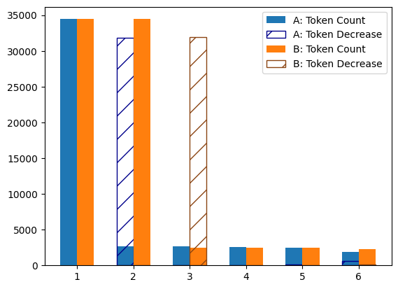
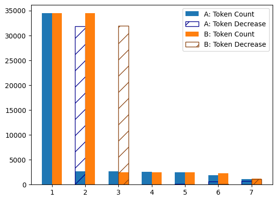
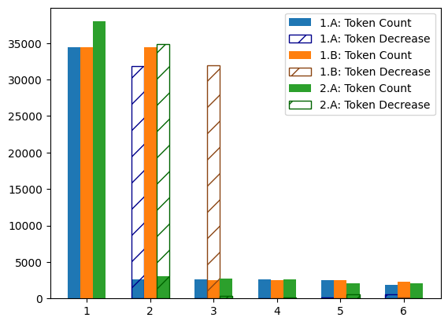

From Hofstra CSC249

# 1: Read the file `alice.txt` as a full String and process it using NLTK library
## 1.A: Tokenize all sentences and extract all tokens from each sentence
* 1616 sentences found

### 1.A.1: Concatenate all tokens into a single list of tokens:
* 34448 tokens found

### 1.A.2: Store unique tokens and their frequencies in a dictionary
* 2625 unique tokens found

### 1.A.4: Remove all punctuation marks
* 2594 unique tokens found (after punctuation removed)
* 10 most frequent words:
    * the: 1639
	* and: 866
	* to: 725
	* a: 631
	* it: 595
	* she: 553
	* i: 545
	* of: 511
	* said: 462
	* you: 411
* 10 least frequent words:
	* x: 1
	* xi: 1
	* xii: 1
	* yards: 1
	* ye: 1
	* years: 1
	* yelled: 1
	* yelp: 1
	* zealand: 1
	* zigzag: 1

### 1.A.5: Remove all stop words
* 2462 unique tokens found (after stop words removed)
* 10 most frequent words:
	* said: 462
	* alice: 399
	* nt: 217
	* little: 128
	* one: 104
	* would: 96
	* know: 88
	* could: 86
	* like: 85
	* went: 83
* 10 least frequent words:
	* x: 1
	* xi: 1
	* xii: 1
	* yards: 1
	* ye: 1
	* years: 1
	* yelled: 1
	* yelp: 1
	* zealand: 1
	* zigzag: 1

### 1.A.6: Stem all remaining words using PorterStemmer
* 1880 unique tokens found (after stemming)
* 10 most frequent words:
	* said: 462
	* alic: 399
	* nt: 217
	* littl: 128
	* one: 105
	* look: 104
	* like: 97
	* would: 96
	* know: 92
	* could: 86
* 10 least frequent words:
	* wriggl: 1
	* writh: 1
	* x: 1
	* xi: 1
	* xii: 1
	* yard: 1
	* yell: 1
	* yelp: 1
	* zealand: 1
	* zigzag: 1

## 1.B: Using list of list of sentence tokens from 1.A
### 1.B.1: Extract parts of speech from all tokens in each sentence
* Parts of speech tuples from the middle of the book:
	* ('then', 'RB')
	* ('it', 'PRP')
	* ('was', 'VBD')

### 1.B.2: Lemmatize the nouns, verbs, adjectives, and advetbs in each sentence
1.B.2: Parts of speech tuples from the middle of the book:
	('`', 'None')
	('then', 'r')
	('it', 'p')
	('be', 'v')
	("n't", 'r')

### 1.B.3: Store unique tuples and their frequency in a dictionary
* 2494 unique tuples found

### 1.B.4: Sort dictionary by frequency
* 10 most frequent words:
	* (',', 'None'): 2418
	* ('the', 'd'): 1639
	* ('`', 'None'): 1109
	* ("'", 'None'): 1064
	* ('.', 'None'): 970
	* ('and', 'c'): 866
	* ('be', 'v'): 848
	* ('to', 't'): 725
	* ('a', 'd'): 631
	* ('it', 'p'): 595
* 10 least frequent words:
	* ('x', 'v'): 1
	* ('xi', 'n'): 1
	* ('xii', 'n'): 1
	* ('yard', 'n'): 1
	* ('ye', 'n'): 1
	* ('yell', 'v'): 1
	* ('yelp', 'n'): 1
	* ('yes', 'u'): 1
	* ('zealand', 'n'): 1
	* ('zigzag', 'n'): 1

### 1.B.5: Remove all punctuation marks
* 2474 unique tuples found
* 10 most frequent words:
	* ('the', 'd'): 1639
	* ('and', 'c'): 866
	* ('be', 'v'): 848
	* ('to', 't'): 725
	* ('a', 'd'): 631
	* ('it', 'p'): 595
	* ('she', 'p'): 553
	* ('say', 'v'): 532
	* ('of', 'i'): 511
	* ('you', 'p'): 411
* 10 least frequent words:
	* ('x', 'v'): 1
	* ('xi', 'n'): 1
	* ('xii', 'n'): 1
	* ('yard', 'n'): 1
	* ('ye', 'n'): 1
	* ('yell', 'v'): 1
	* ('yelp', 'n'): 1
	* ('yes', 'u'): 1
	* ('zealand', 'n'): 1
	* ('zigzag', 'n'): 1

### 1.B.6: Remove all tuples that are not nouns, adjectives, adverbs, or verbs
* 2305 unique tuples found
* 10 most frequent words:
	* ('be', 'v'): 848
	* ('say', 'v'): 532
	* ('i', 'n'): 335
	* ('alice', 'n'): 312
	* ('have', 'v'): 293
	* ('do', 'v'): 263
	* ("n't", 'r'): 217
	* ('go', 'v'): 179
	* ('not', 'r'): 146
	* ('very', 'r'): 144
* 10 least frequent words:
	* ('wrong', 'r'): 1
	* ('x', 'v'): 1
	* ('xi', 'n'): 1
	* ('xii', 'n'): 1
	* ('yard', 'n'): 1
	* ('ye', 'n'): 1
	* ('yell', 'v'): 1
	* ('yelp', 'n'): 1
	* ('zealand', 'n'): 1
	* ('zigzag', 'n'): 1

## 1.C: Observations
Part B (lemmatization) results in the better list of tokens. Not only does it include more overall information (parts of speech), but the end result has less tokens overall since most unimportant words (i.e: prepositions) are removed. In addition to that, the stemming in part A results in some very strange words after stemming, such as changing "Alice" to "Alic" or "little" to "littl".

* 1.A:
	* 1: 34448 tokens
	* 2: 2625 tokens (- 31823)
	* 3: 2625 tokens (- 0)
	* 4: 2594 tokens (- 31)
	* 5: 2462 tokens (- 132)
	* 6: 1880 tokens (- 582)
* 1.B:
	* 1: 34448 tokens
	* 2: 34448 tokens (- 0)
	* 3: 2494 tokens (- 31954)
	* 4: 2494 tokens (- 0)
	* 5: 2474 tokens (- 20)
	* 6: 2305 tokens (- 169)

 ## 1.D: Additional processing step/s
 It could be useful to use the token frequencies to remove tokens that only appear once or twice in the text. These words are very unimportant to the subject matter. Therefore extraneous information would be removed, shortening the token list.

* 1.A:
	* 1: 34448 tokens
	* 2: 2625 tokens (- 31823)
	* 3: 2625 tokens (- 0)
	* 4: 2594 tokens (- 31)
	* 5: 2462 tokens (- 132)
	* 6: 1880 tokens (- 582)
	* 7: 1135 tokens (- 745)
* 1.B:
	* 1: 34448 tokens
	* 2: 34448 tokens (- 0)
	* 3: 2494 tokens (- 31954)
	* 4: 2494 tokens (- 0)
	* 5: 2474 tokens (- 20)
	* 6: 2305 tokens (- 169)
	* 7: 1201 tokens (- 1104)

# 2:
## 2.A: Use the `spacy` library to tokenize and lemmatize the same text 
* 37965 tokens found.
* 3102 unique tokens found.
	* 10 most frequent words:
		* (',', 'PUNCT'): 2418
		* ('\n', 'SPACE'): 1750
		* ('the', 'DET'): 1639
		* ('`', 'PUNCT'): 1103
		* ("'", 'PUNCT'): 1080
		* ('.', 'PUNCT'): 972
		* ('and', 'CCONJ'): 869
		* ('\n\n  ', 'SPACE'): 731
		* (' ', 'SPACE'): 682
		* ('a', 'DET'): 631
	* 10 least frequent words:
		* ('yawning', 'NOUN'): 1
		* ('yawning', 'VERB'): 1
		* ('ye', 'ADJ'): 1
		* ('years', 'NOUN'): 1
		* ('yelled', 'VERB'): 1
		* ('yelp', 'NOUN'): 1
		* ("you've", 'X'): 1
		* ('yours', 'PRON'): 1
		* ('zealand', 'PROPN'): 1
		* ('zigzag', 'NOUN'): 1
* 2740 unique tokens found (after stop words removed).
	* 10 most frequent words:
		* (',', 'PUNCT'): 2418
		* ('\n', 'SPACE'): 1750
		* ('`', 'PUNCT'): 1103
		* ("'", 'PUNCT'): 1080
		* ('.', 'PUNCT'): 972
		* ('\n\n  ', 'SPACE'): 731
		* (' ', 'SPACE'): 682
		* ('said', 'VERB'): 456
		* ('!', 'PUNCT'): 446
		* ('alice', 'PROPN'): 320

	* 10 least frequent words:
		* ('yawned', 'VERB'): 1
		* ('yawning', 'NOUN'): 1
		* ('yawning', 'VERB'): 1
		* ('ye', 'ADJ'): 1
		* ('years', 'NOUN'): 1
		* ('yelled', 'VERB'): 1
		* ('yelp', 'NOUN'): 1
		* ("you've", 'X'): 1
		* ('zealand', 'PROPN'): 1
		* ('zigzag', 'NOUN'): 1
* 2620 unique tokens found (after punctuation removed).
	* 10 most frequent words:
		* ('said', 'VERB'): 456
		* ('alice', 'PROPN'): 321
		* ('little', 'ADJ'): 127
		* ('know', 'VERB'): 88
		* ('went', 'VERB'): 82
		* ('queen', 'NOUN'): 75
		* ('time', 'NOUN'): 71
		* ('thought', 'VERB'): 69
		* ('king', 'NOUN'): 63
		* ('turtle', 'NOUN'): 59

	* 10 least frequent words:
		* ('yawned', 'VERB'): 1
		* ('yawning', 'NOUN'): 1
		* ('yawning', 'VERB'): 1
		* ('ye', 'ADJ'): 1
		* ('years', 'NOUN'): 1
		* ('yelled', 'VERB'): 1
		* ('yelp', 'NOUN'): 1
		* ('youve', 'X'): 1
		* ('zealand', 'PROPN'): 1
		* ('zigzag', 'NOUN'): 1
* 2098 unique tokens found (after lemmatization).
	* 10 most frequent words:
		* ('say', 'VERB'): 475
		* ('alice', 'PROPN'): 321
		* ('think', 'VERB'): 131
		* ('go', 'VERB'): 129
		* ('little', 'ADJ'): 127
		* ('know', 'VERB'): 107
		* ('look', 'VERB'): 98
		* ('begin', 'VERB'): 91
		* ('come', 'VERB'): 89
		* ('thing', 'NOUN'): 79
	* 10 least frequent words:
		* ('xi', 'PROPN'): 1
		* ('xii', 'PROPN'): 1
		* ('yawned', 'ADJ'): 1
		* ('yawning', 'NOUN'): 1
		* ('ye', 'ADJ'): 1
		* ('yell', 'VERB'): 1
		* ('yelp', 'NOUN'): 1
		* ('youve', 'X'): 1
		* ('zealand', 'PROPN'): 1
		* ('zigzag', 'NOUN'): 1
* 1.A:
	* 1: 34448 tokens
	* 2: 2625 tokens (- 31823)
	* 3: 2625 tokens (- 0)
	* 4: 2594 tokens (- 31)
	* 5: 2462 tokens (- 132)
	* 6: 1880 tokens (- 582)
* 1.B:
	* 1: 34448 tokens
	* 2: 34448 tokens (- 0)
	* 3: 2494 tokens (- 31954)
	* 4: 2494 tokens (- 0)
	* 5: 2474 tokens (- 20)
	* 6: 2305 tokens (- 169)
* 2.A:
	* 1: 37965 tokens
	* 2: 3102 tokens (- 34863)
	* 3: 2740 tokens (- 362)
	* 4: 2620 tokens (- 120)
	* 5: 2098 tokens (- 522)
	* 6: 2098 tokens (- 0)

## 2.B: Observations
Using spaCy produced a final token count greater than that of part 1.A, and less than that of part 1.B (not counting the additional final step). However, the initial token count is much higher due to the amount of whitespace strings that were counted as individual tokens. This caused the number of tokens removed in the first step to be greater than in the previous parts. It was much easier to perform these steps using spaCy, since it's builtin pipelines made it much easier to test for different attributes (ie: if a token was punctuation or a stop word)

## 2.C: Additional Processing Step/s
There is a lot more information on the exact part of speech for each token in spacy. Using this, I will further remove unimportant words from the token list.

I use the dep_ attribute to get the exact part of speech. I don't know what most of the abbhreviations mean, so to better understand that I find the unique list of dep_ values for the remaining tokens, and how many unique (lemmatized) tokens are categorized under that value and none of the others. This lets me see which categories have less than 10 unique words in them. Any words in these categories, or that are not nouns, adjectives, verbs, or adverbs can be removed. I am also removing the tokens with a frequency of only 1, since that was also done in the first 2 parts.

* 1021 unique tokens found.
* 10 most frequent words:
	* ('say', 'verb'): 464
	* ('alice', 'propn'): 304
	* ('think', 'verb'): 127
	* ('go', 'verb'): 121
	* ('little', 'adj'): 112
	* ('know', 'verb'): 100
	* ('look', 'verb'): 94
	* ('begin', 'verb'): 85
	* ('come', 'verb'): 83
	* ('thing', 'noun'): 78
* 10 least frequent words:
	* ('wild', 'adj'): 2
	* ('wildly', 'adv'): 2
	* ('wind', 'noun'): 2
	* ('wine', 'noun'): 2
	* ('wise', 'adj'): 2
	* ('woman', 'noun'): 2
	* ('wonder', 'noun'): 2
	* ('wonderful', 'adj'): 2
	* ('wretched', 'adj'): 2
	* ('yawn', 'verb'): 2
* 1.A:
	* 1: 34448 tokens
	* 2: 2625 tokens (- 31823)
	* 3: 2625 tokens (- 0)
	* 4: 2594 tokens (- 31)
	* 5: 2462 tokens (- 132)
	* 6: 1880 tokens (- 582)
	* 7: 1135 tokens (- 745)
* 1.B:
	* 1: 34448 tokens
	* 2: 34448 tokens (- 0)
	* 3: 2494 tokens (- 31954)
	* 4: 2494 tokens (- 0)
	* 5: 2474 tokens (- 20)
	* 6: 2305 tokens (- 169)
	* 7: 1201 tokens (- 1104)
* 2.A:
	* 1: 37965 tokens
	* 2: 3102 tokens (- 34863)
	* 3: 2740 tokens (- 362)
	* 4: 2620 tokens (- 120)
	* 5: 2098 tokens (- 522)
	* 6: 2098 tokens (- 0)
	* 7: 1021 tokens (- 1077)

By further analyzing the parts of speech, as well as removing words with a frequency of 1 again, the list of tokens is now shorter than the final token lists from both previous parts.

# References Used
* Geeks4Geeks
	* spaCy tokenization: https://www.geeksforgeeks.org/nlp/tokenization-using-spacy-library/
* Stack Overflow
  	* Dictionary sorting: https://stackoverflow.com/questions/613183/how-do-i-sort-a-dictionary-by-value
	* Stop word removal: https://stackoverflow.com/questions/55817040/removing-stop-words-using-spacy